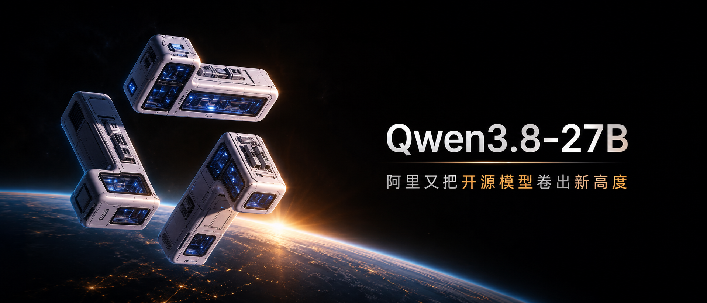
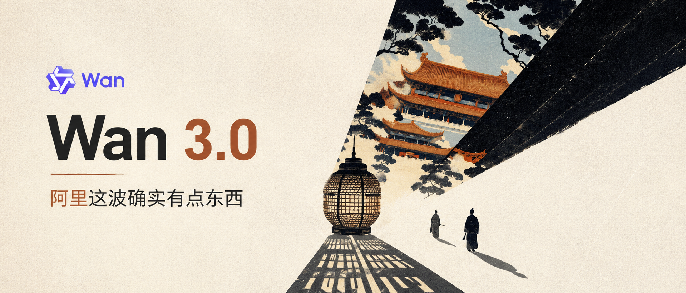

# WeChat Cover Studio

一个专门生成和修改微信公众号横版封面的 **ChatGPT + Codex 双兼容 Skill**,推荐在ChatGPT使用image2.5使用。

你只需要提供 **产品 Logo + 主标题 + 副标题**，再按需提供一张背景参考图或一句视觉方向描述，它就会结合产品气质、文章主题和历史优质案例，直接生成一张可用的 **2.35:1 公众号封面**。

背景参考图不是必填项。没有参考图时，skill 会根据产品、标题和你的背景偏好自行构思；有参考图时，它会判断应该沿用完整背景、提取其中的视觉元素，还是只借鉴氛围后重新设计。

## 优质封面示例

这些案例代表了本 skill 希望稳定复现的完成度：主题元素明确、背景有记忆点、文字层级清楚、Logo 使用克制，而且画面与产品或文章主题真正相关。

| Qwen3.8-27B：产品概念转为空间视觉 | 百度搭子：品牌组件转为立体场景 |
| :--: | :--: |
|  |  |
| **DeepSeek Harness 插件：主题元素与产品联想结合** | **Wan 3.0：品牌气质与东方视觉结合** |
|  |  |

四张图采用了不同风格，但遵循同一套原则：**先找到和产品或主题有关的视觉锚点，再围绕锚点组织背景、Logo、标题与留白**。因此，最推荐的输入方式不是只说“做一张科技感封面”，而是提供一张相关图片、一个具体物件，或一句足够明确的画面方向。

## 它能做什么

- 从 Logo、主标题和副标题出发，直接生成完整公众号封面。
- 使用产品截图、案例成图、角色、物件或场景作为背景参考。
- 没有参考图时，自行把产品定位和标题语义转成视觉概念。
- 在现有封面基础上局部修改，例如纠正文字、调整字号、移动 Logo 或替换背景。
- 根据历史正反例检查错字、多余文字、字号失衡、Logo 变形和“AI 味过重”等常见问题。

## 安装与调用

### 在 ChatGPT 中安装

ChatGPT 不会因为 GitHub 仓库公开就自动安装 Skill；需要首次上传一次 Skill 压缩包。安装完成后，它会保存在你的 ChatGPT Skills 列表里，以后无需再次粘贴 GitHub 链接。

1. 下载 [ChatGPT / Codex 通用安装包 `wechat-cover-studio.zip`](https://github.com/54singa/wechat-cover-studio/releases/latest/download/wechat-cover-studio.zip)。
2. 在 ChatGPT 侧边栏进入 **Plugins（插件）**，打开 **Skills（技能）** 标签页。
3. 选择 **Create（创建）→ Upload from your computer（从计算机上传）**，上传压缩包。
4. 扫描并安装完成后，可以在技能列表中直接选中“公众号封面工作室”，也可以在对话中输入 `$wechat-cover-studio` 调用。

安装后可直接这样使用：

```text
使用 $wechat-cover-studio 做一张公众号封面。
主标题：……
副标题：……
Logo 和背景参考见附件。
```

> ChatGPT Skills 的可用性取决于账号套餐、工作区设置和当前产品开放范围。如果界面里没有 Plugins / Skills 或 Upload 入口，需要由工作区管理员开启相应权限。具体入口与权限说明见 [OpenAI 官方的 ChatGPT Skills 指南](https://help.openai.com/en/articles/20001066-skills-in-chatgpt)。

### 在 Codex 中安装

将仓库克隆或下载到 Codex 的 skills 目录：

```bash
git clone https://github.com/54singa/wechat-cover-studio.git ~/.codex/skills/wechat-cover-studio
```

重新打开 Codex 后，通过 `$wechat-cover-studio` 调用；安装后也可以在适合的封面任务中自动触发。

### 双端共用方式

仓库根目录的 `SKILL.md` 是 ChatGPT 和 Codex 共用的核心指令，`references/` 中的案例、完整提示词与正反例也会一同打包。`agents/openai.yaml` 提供技能列表中的展示名称、简介、默认调用语句与自动触发策略。

同一个压缩包可以上传到 ChatGPT，也可以解压到 Codex 的 skills 目录，无需维护两套提示词。

## 推荐用法

最完整的输入由下面四部分组成：

1. **产品 Logo**：上传 Logo 原图，并说明使用完整标志、只用图标，还是保留产品名。
2. **主标题**：需要出现在封面上的核心标题，必须逐字准确。
3. **副标题**：补充情绪、结论或卖点，同样必须逐字准确。
4. **背景参考**（可选）：可以上传图片，也可以只描述想要的元素、色彩、材质、构图或氛围。

基础模板：

```text
使用 $wechat-cover-studio 直接生成一张公众号横版封面。

产品 Logo：见附件 1（说明使用完整 Logo，或只使用图标）
主标题：……
副标题：……
背景参考：见附件 2；希望保留/提取……
背景偏好：……（可选）
其他限制：……（可选，例如主标题必须单行、不要额外小字）
```

如果没有背景参考图，可以这样写：

```text
背景参考图：不提供。请根据产品、标题和以下偏好自行生成背景。
背景偏好：深色、克制、有真实材质感；避免淡蓝配白和模板化 AI 科技风。
```

除非你明确要求只输出提示词，否则 skill 的目标是**直接生成成品封面**。如果当时没有可用的图像生成能力，它会给出可直接用于图像模型的完整提示词。

## 背景的三种处理方式

不同类型的参考图不能用同一种方式处理。skill 会先判断你提供的图片属于哪一类，再选择对应策略。

| 模式 | 适合提供什么 | 处理方式 |
| --- | --- | --- |
| **1. 把现有图片作为完整背景** | 案例效果图、产品渲染图、摄影图，画面本身已经接近想要的效果 | 尽量保留主体、光影、材质和氛围，在 2.35:1 画布上重新安排留白、Logo 和标题，不无故重画满意的内容。 |
| **2. 只提取参考图中的视觉元素** | 角色、动物、产品形态、某种构图、颜色或材质参考 | 提取用户指定的元素并重新设计成适合公众号封面的背景；不照抄原图里的字幕、按钮、播放器界面、水印或无关 UI。 |
| **3. 不提供参考图，由 skill 自行构思** | 只有产品、标题和风格偏好 | 从产品定位、品牌气质和标题语义中找一个具体视觉锚点，自行生成场景；如果连偏好也没有，则选择最能表达主题且适合横版排版的方向。 |

推荐至少提供一种与产品或主题有关的背景线索，例如：

- 一张产品界面、案例成图或宣传视觉；
- 一个核心物件或角色，如鲸鱼、积木组件、太空模块；
- 一句具体方向，如“东方建筑与大透视感”“黑金界面在空间中展开”“真实海水、斗鱼和红青鳞光”。

具体线索通常比“高级感”“科技感”“未来感”这类宽泛形容词更容易得到有辨识度的结果。

## 两个可复制实例

### 实例 1：提供 Logo 和背景元素参考

```text
使用 $wechat-cover-studio 直接生成公众号封面。

产品 Logo：附件 1，只使用图标，不要自行重绘
主标题：DeepSeek Harness插件
副标题：一篇讲明白怎么玩出花
背景参考：附件 2。只参考其中鲸鱼的形态与动态，不要保留原图文字或界面元素
背景偏好：深海蓝色，一条发光鲸鱼位于右侧，带细密数据流与粒子轨迹；左侧留出干净文字区
其他限制：只出现 Logo、主标题和副标题，不添加英文说明或装饰性小字
```

这个输入属于“提取参考图中的视觉元素”：参考图负责提供鲸鱼，封面则围绕 DeepSeek 的品牌联想重新组织颜色、光线和版式。

### 实例 2：不提供背景参考图

```text
使用 $wechat-cover-studio 直接生成公众号封面。

产品 Logo：附件 1，保留图标和产品名
主标题：AI Agent还能这么玩
副标题：三个真实案例拆给你看
背景参考图：不提供
背景偏好：请结合 Agent 的协作与连接概念自行构思。整体可以深色，但颜色要鲜明；希望有真实材质和空间层次，不要淡蓝配白的通用 AI 视觉
其他限制：主标题保持单行，文字不要占满画面，不添加案例编号或功能标签
```

这个输入属于“无参考图自行构思”：skill 会先把“协作与连接”转化为具体视觉锚点，再生成适合横版封面的背景，而不是简单堆叠机器人、芯片和发光线条。

## 封面设计规则

### 画布与构图

- 默认比例为 **2.35:1**，适用于微信公众号横版封面。
- 不固定使用“左文右图”；根据背景主体、视线方向和留白决定文字放左、放右或融入场景。
- 背景承担主要视觉吸引力，标题负责快速传达信息，两者不能互相遮挡。
- 重要内容要避开边缘，确保在不同设备的裁切与缩略图状态下仍然可读。

### 标题与文字

- 主标题和副标题必须与用户输入逐字一致，包括中文、英文、数字、大小写和标点。
- 默认只出现用户指定的主标题、副标题和 Logo，不擅自增加英文标签、功能点、案例编号、日期或说明小字。
- 主标题要醒目但不能压住背景；副标题清晰可读，但不应弱到缩略图中消失。
- 用户要求单行时必须保持单行；文字过长时优先优化字号、字距和版面，不擅自改写。
- 可以用少量颜色强调关键词，但不能把一句话切成过多视觉碎片。

### Logo 与品牌

- 优先使用用户提供的原始 Logo，不重新绘制、不变形、不改变图形结构。
- 严格遵守“只用图标”“保留产品名”或“使用完整 Logo”等要求。
- Logo 应清晰可见但不抢标题，也不能被背景高光或复杂纹理吞没。
- 历史案例只用于校准审美与判断标准，不授权复用其中的品牌、人物或文案。

### 背景与风格

- 背景应与产品、文章主题或标题中的核心概念有关，而不是使用无意义的通用科技素材。
- “避免 AI 味”不等于禁用蓝色、渐变、3D 或光效；关键是避免淡蓝配白、塑料感、模板化芯片、无意义悬浮图标和过度光污染的机械组合。
- 颜色可以鲜艳、显眼，但要有主色与重点色，不能让所有元素同时争抢注意力。
- 优先建立真实的材质、光影和空间关系；即使是抽象背景，也应有明确的视觉中心。
- 修改已有封面时，只处理用户指出的问题，保留已经满意的主体、构图和风格。

## 生成前后的检查

skill 会重点检查：

- 画布是否接近 2.35:1；
- 主标题、副标题是否逐字正确；
- 是否出现用户没有要求的额外文字；
- Logo 是否正确、清晰且比例正常；
- 主副标题字号和层级是否均衡；
- 背景是否真正服务于主题；
- 是否误把参考图中的字幕、UI、水印或播放器控件带入成图；
- 整体是否在缩略图尺寸下仍然醒目、清楚、有辨识度。

## 仓库内容

- `SKILL.md`：核心工作流、生成规则和验收标准。
- `agents/openai.yaml`：skill 的名称、描述与调用配置。
- `references/cases.md`：优质案例与失败案例索引。
- `references/prompts/`：历史案例中完整、可复用的生成提示词。
- `references/images/`：用于风格校准的正反例图片。
- `references/feedback.md`：真实修改反馈与规则优先级。

完整提示词和失败案例同样是 skill 的重要组成部分：优质案例定义目标，失败案例则帮助它避开错字、标题过大或过小、乱加小字、背景跑题等已经验证过的问题。
